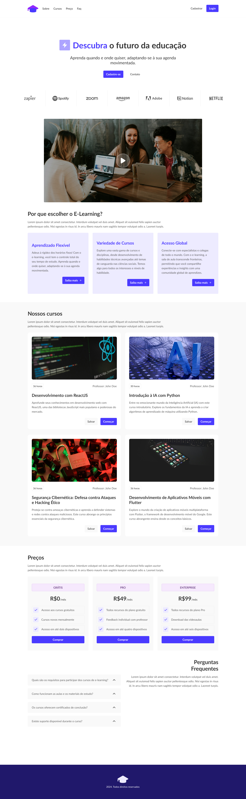
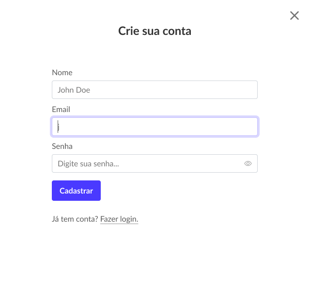

# Teste para FIEMG, utilizando HTML, CSS, Javascript e Bootstrap
O intuito do teste era avaliar a fidelidade com o protótipo fornecido. 
Além de adicionar funcionalidades de design resposivo e interações JS.

## Abra o site
```bash
https://okelvincosta.github.io/fiemg-teste/
```

## Design das Telas


ou
```bash
https://www.figma.com/design/sYXUA4aHmBCTcddbZEi2tt/Teste-t%C3%A9cnico-web-designer?node-id=2-2&t=tBWN0OTUlEglnBna-0
```
